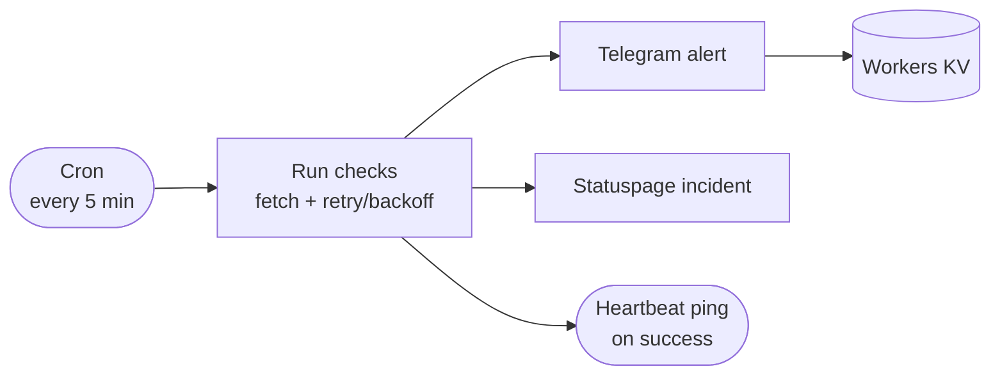

# Uptime — Serverless Uptime Monitoring on Cloudflare Workers

[](https://github.com/hobroker/uptime/actions/workflows/ci.yaml)
[](LICENSE)
[](https://www.typescriptlang.org/)

**Uptime** is a lightweight, serverless monitoring service that runs on a **Cloudflare Workers** cron trigger. Every few minutes it performs a configurable list of health **checks**, and when something goes down it opens a **Telegram** thread and (optionally) drives incidents on **Statuspage.io** — then updates and resolves them automatically as services recover.

It also watches itself: a **dead-man's-switch heartbeat** lets an external monitor alert you if the worker ever stops running.

> [!NOTE]
> There's no server to run and nothing to keep alive — the whole thing is one Cloudflare Worker plus a KV namespace.

## Table of Contents

- [Features](#features)
- [How It Works](#how-it-works)
- [Repository Layout](#repository-layout)
- [Tech Stack](#tech-stack)
- [Getting Started](#getting-started)
  - [Prerequisites](#prerequisites)
  - [Quick Start](#quick-start)
  - [Manual Setup](#manual-setup)
- [Configuration](#configuration)
  - [Checks](#checks)
  - [Environment Variables & Secrets](#environment-variables--secrets)
  - [Cron Schedule](#cron-schedule)
- [Notifications](#notifications)
- [Self-Monitoring (Dead-Man's-Switch)](#self-monitoring-dead-mans-switch)
- [Deployment](#deployment)
- [Local Development](#local-development)
- [Scripts](#scripts)
- [Contributing](#contributing)
- [License](#license)

## Features

- **Active monitoring** — periodically probes each configured target on a cron schedule.
- **Resilient checks** — configurable timeout and retries with exponential backoff, so a single transient blip doesn't page you.
- **Smart Telegram alerts** — a single downtime message that edits itself in place as the set of failing checks changes, then gets a recovery reply once everything is back.
- **Statuspage.io sync (optional)** — maps each check to a component and manages the full incident lifecycle: open → update → resolve → postmortem.
- **Cloudflare Zero Trust support** — probe sites behind Cloudflare Access using a service token, and treat an Access login page as a failure.
- **Dead-man's-switch (optional)** — pings an external heartbeat monitor after every successful run, so you're alerted if the monitor itself dies.
- **Serverless** — runs entirely on Cloudflare Workers + Workers KV. No servers, no containers.

## How It Works



1. A scheduled Worker fires on the cron defined in `packages/uptime-worker/wrangler.jsonc` (default: every 5 minutes).
2. Each check in `uptime.config.ts` is probed (up to 2 concurrently). A non-expected status code, a Cloudflare Access login page, or a timeout marks it **down** — after exhausting its retries.
3. Results are handed to the notification channels:
   - **Telegram** opens or edits a downtime message, and replies with a recovery notice when all checks pass again.
   - **Statuspage** (if configured) sets each component's status and opens/updates/resolves a grouped incident.
4. Each channel persists just the state it needs (e.g. the Telegram message id) in **Workers KV**.
5. On a fully successful run, an optional **heartbeat** ping is sent to an external dead-man's-switch.

## Repository Layout

This is an [npm workspaces](https://docs.npmjs.com/cli/using-npm/workspaces) + [Turborepo](https://turbo.build/) monorepo:

| Package                    | Description                                                               |
| -------------------------- | ------------------------------------------------------------------------- |
| `packages/uptime-worker`   | The Cloudflare Worker: checks, notifications, and scheduling.             |
| `packages/uptime-setup`    | Interactive CLI (`npm run setup`) that provisions Cloudflare and secrets. |
| `packages/uptime-eslint`   | Shared ESLint config.                                                     |
| `packages/uptime-test`     | Shared Vitest config.                                                     |
| `packages/uptime-tsconfig` | Shared TypeScript config.                                                 |

## Tech Stack

- [Cloudflare Workers](https://developers.cloudflare.com/workers/) + [Cron Triggers](https://developers.cloudflare.com/workers/configuration/cron-triggers/)
- [Workers KV](https://developers.cloudflare.com/kv/) for state
- [Wrangler](https://developers.cloudflare.com/workers/wrangler/) for local dev and deploys
- [TypeScript](https://www.typescriptlang.org/)
- [Telegram Bot API](https://core.telegram.org/bots/api) via [grammY](https://grammy.dev/)
- [LiquidJS](https://liquidjs.com/) for message templates
- [Statuspage API](https://developer.statuspage.io/) (optional)

## Getting Started

### Prerequisites

- [Node.js](https://nodejs.org/) 20+ and npm.
- A [Cloudflare](https://www.cloudflare.com/) account.
- A [Telegram bot](https://core.telegram.org/bots#how-do-i-create-a-bot) token and the chat id to notify.

### Quick Start

```shell
# 1. Clone
git clone https://github.com/hobroker/uptime.git
cd uptime

# 2. Install
npm install

# 3. Run the interactive setup
npm run setup
```

The setup wizard (`packages/uptime-setup`) will:

- Log you in to Cloudflare (via `wrangler login`).
- Create the `uptime` KV namespace and write its id into `wrangler.jsonc`.
- Optionally prompt for and set your Telegram / Statuspage secrets.
- Create a local `.dev.vars` from the example.

Then configure your monitors in `packages/uptime-worker/uptime.config.ts` (see [Configuration](#configuration)) and deploy:

```shell
npm run deploy
```

### Manual Setup

Prefer to wire things up yourself? The wizard is optional:

1. **KV namespace** — `npx wrangler kv namespace create uptime`, then put the returned id under `kv_namespaces` in `packages/uptime-worker/wrangler.jsonc`.
2. **Secrets** — set each with `npx wrangler secret put <NAME>` (see [Environment Variables & Secrets](#environment-variables--secrets)).
3. **Local vars** — copy `packages/uptime-worker/.dev.vars.example` to `.dev.vars` and fill in values for local runs.

## Configuration

### Checks

Monitors are defined in `packages/uptime-worker/uptime.config.ts`:

```typescript
import { UptimeWorkerConfig } from "./src/types";

// Reusable helper for targets behind Cloudflare Access.
const zeroTrustAuth = ({ env }: { env: Env }) => ({
  "CF-Access-Client-Id": env.CF_ACCESS_CLIENT_ID,
  "CF-Access-Client-Secret": env.CF_ACCESS_CLIENT_SECRET,
});

export const uptimeWorkerConfig: UptimeWorkerConfig = {
  // Optional: link included in notifications.
  statuspageUrl: "https://your-org.statuspage.io",
  checks: [
    {
      name: "My Website",
      target: "https://example.com",
      retryCount: 2,
    },
    {
      name: "Internal Service",
      target: "https://internal.example.com",
      headers: zeroTrustAuth,
      retryCount: 1,
    },
  ],
};
```

Each check supports:

| Field           | Type                       | Default  | Description                                                             |
| --------------- | -------------------------- | -------- | ----------------------------------------------------------------------- |
| `name`          | `string`                   | —        | Display name (also the Statuspage component name). **Required.**        |
| `target`        | `string`                   | —        | URL to probe. **Required.**                                             |
| `method`        | `string`                   | `"GET"`  | HTTP method.                                                            |
| `probeTarget`   | `string`                   | `target` | Override the URL actually requested (e.g. a dedicated health endpoint). |
| `expectedCodes` | `number[]`                 | `[200]`  | Status codes considered healthy.                                        |
| `timeout`       | `number`                   | `10000`  | Per-attempt timeout in ms.                                              |
| `retryCount`    | `number`                   | `0`      | Retries before marking down. Backoff is exponential, starting at 5s.    |
| `headers`       | `({ env }) => HeadersInit` | —        | Function returning request headers (great for auth secrets).            |
| `body`          | `({ env }) => BodyInit`    | —        | Function returning a request body.                                      |

### Environment Variables & Secrets

Set production values with `npx wrangler secret put <NAME>`; for local development put them in `packages/uptime-worker/.dev.vars` (see `.dev.vars.example`).

| Variable                  | Required | Purpose                                                                                |
| ------------------------- | -------- | -------------------------------------------------------------------------------------- |
| `TELEGRAM_BOT_TOKEN`      | ✅       | Telegram bot token used to send/edit messages.                                         |
| `TELEGRAM_CHAT_ID`        | ✅       | Chat that receives notifications.                                                      |
| `STATUSPAGE_IO_API_KEY`   | optional | Enables Statuspage sync.                                                               |
| `STATUSPAGE_IO_PAGE_ID`   | optional | Statuspage page to manage.                                                             |
| `HEARTBEAT_URL`           | optional | Dead-man's-switch ping URL (see [Self-Monitoring](#self-monitoring-dead-mans-switch)). |
| `CF_ACCESS_CLIENT_ID`     | optional | Cloudflare Access service token id (used by the `zeroTrustAuth` helper).               |
| `CF_ACCESS_CLIENT_SECRET` | optional | Cloudflare Access service token secret.                                                |

> [!TIP]
> The setup wizard prompts for the Telegram and Statuspage secrets. `HEARTBEAT_URL` and the `CF_ACCESS_*` service token are set manually with `wrangler secret put`.

### Cron Schedule

The schedule lives in `packages/uptime-worker/wrangler.jsonc`:

```jsonc
"triggers": {
  "crons": ["*/5 * * * *"], // every 5 minutes
}
```

## Notifications

**Telegram** — When one or more checks go down, Uptime posts a single message listing them. As the set of failing checks changes, it **edits that same message** rather than spamming new ones. When everything recovers, it replies to the thread with a recovery notice. Message bodies are rendered with LiquidJS and HTML-escaped, so upstream error text can't inject markup.

**Statuspage.io** (optional) — Each check maps to a component whose status is kept in sync (`operational` / `major_outage`). Failing checks are grouped into a single incident that is opened, updated as the affected set changes, and finally **resolved with a postmortem** on recovery.

### Example Telegram message


## Self-Monitoring (Dead-Man's-Switch)

A monitor that only speaks up when it runs can fail silently — if the Worker stops being scheduled or crashes before finishing, nothing tells you. To close that gap, set `HEARTBEAT_URL` to a ping URL from an **independent** heartbeat service ([Dead Man's Snitch](https://deadmanssnitch.com/), [healthchecks.io](https://healthchecks.io/), [BetterStack](https://betterstack.com/), [Cronitor](https://cronitor.io/), …).

After every **successful** run, Uptime sends a `GET` to that URL. If a run fails or the Worker stops firing, the pings stop and the external service alerts you — through a path that doesn't depend on Cloudflare.

1. Create a check on your provider; pick the coarsest interval that still catches real downtime (the 5-minute cron will ping comfortably within it).
2. `npx wrangler secret put HEARTBEAT_URL` with the ping URL.
3. Route that provider's alert wherever you like (e.g. the same Telegram chat).

## Deployment

Deploy manually at any time with:

```shell
npm run deploy   # turbo -> wrangler deploy
```

For continuous deployment, connect the repository to **[Cloudflare Workers Builds](https://developers.cloudflare.com/workers/ci-cd/builds/)** in the Cloudflare dashboard — Cloudflare then builds and deploys on every push to your default branch. (Deployment is handled natively by Cloudflare; there is no GitHub Actions deploy workflow.)

## Local Development

```shell
# Start the worker locally (with scheduled-handler testing enabled)
npm run dev
```

Uptime is driven by a Cron Trigger, so there's no page to visit. Simulate a scheduled run by hitting the `/__scheduled` endpoint Wrangler exposes:

```shell
curl "http://localhost:8787/__scheduled?cron=*+*+*+*+*"
```

## Scripts

Run from the repo root; Turborepo fans them out across packages.

| Script               | Description                                            |
| -------------------- | ------------------------------------------------------ |
| `npm run setup`      | Interactive Cloudflare + secrets setup wizard.         |
| `npm run dev`        | Run the worker locally with `--test-scheduled`.        |
| `npm run deploy`     | Deploy the worker with Wrangler.                       |
| `npm test`           | Run the Vitest suites.                                 |
| `npm run lint`       | Lint all packages.                                     |
| `npm run ts-check`   | Generate Cloudflare types and type-check.              |
| `npm run format`     | Format with Prettier.                                  |
| `npm run cf-typegen` | Regenerate Worker binding types from `wrangler.jsonc`. |

## Contributing

Contributions are welcome — issues and pull requests alike. Before opening a PR, please make sure the checks pass:

```shell
npm run lint
npm run ts-check
npm test
```

CI runs these on every push, so it's the same gate your PR will face.

## License

Licensed under the [MIT License](https://opensource.org/licenses/MIT). See [LICENSE](LICENSE) for details.

---

[](https://coff.ee/hobroker)
